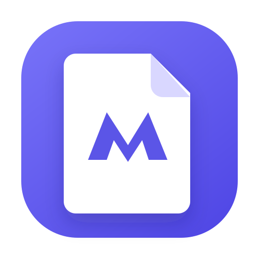

<p align="center">
  
</p>

# Aladdeen Research

Aladdeen Research is a responsive, offline-first research workspace made only for macOS arm64 on M-series Apple silicon (M1 or newer). It brings Markdown, HTML, DOCX, and PDF sources into one calm place while keeping every document at its original disk location. Documents are never copied, converted, or uploaded.

Aladdeen is proprietary, closed-source software by Ali Ahad. Access is free during the current beta-testing period; this does not grant an open-source license, and future releases may be sold commercially.

## Features

- Native format adapters that are loaded only when their document type is opened
- Rich Markdown editing and preview with PDF/DOCX export
- Exact HTML source editing with an isolated, live local preview
- Direct OOXML editing for DOCX with formatting, comments, and tracked-change modes
- PDF reading, selectable text, forms, annotations, signatures, and page tools
- Named environments containing multiple folder projects and standalone files
- Bulk-linked project folders with all-files or selective indexing, exclusions, groups, favorites, and archive/pause controls
- Lazy searchable project trees, persistent recent files, cross-project Quick Open, and mixed-project draggable tabs
- Cancellable environment-wide search across every supported document format
- Debounced atomic autosave with external-change conflict recovery
- GFM tables, task lists, fenced code highlighting, and local images
- Finder drag-and-drop that opens original documents in tab order
- Light, dark, system, and accent themes
- Native create/add, rename, reveal, Trash, missing-file relink, open-file association, and per-environment session restore
- Sandboxed renderer with a narrow, validated IPC bridge

## Development

Requirements: Node.js 24+ and pnpm 11+.

```bash
pnpm install
pnpm dev
```

Useful checks:

```bash
pnpm typecheck
pnpm lint
pnpm test
pnpm build
```

## Packaging

```bash
pnpm dist:mac
```

Aladdeen produces macOS arm64 DMG and ZIP artifacts only. Release packaging is guarded to native M-series Macs, and builds are ad-hoc signed so the Electron bundle is internally valid without
requiring a paid Apple Developer account. They are not notarized, so macOS requires
the user to approve the first launch in System Settings → Privacy & Security. The
GitHub Actions workflow builds on a native macOS arm64 runner. Auto-update and
publishing are intentionally not configured.

## Keyboard shortcuts

- `Cmd+O`: open a document
- `Cmd+N`: create a Markdown document
- `Cmd+Shift+O`: add an existing folder project
- `Cmd+P`: search every indexed project file
- `Cmd+Shift+F`: search document contents in the active environment
- `Cmd+S`: flush autosave now
- `Cmd+E`: toggle Markdown editing

Environment, project-index, and recent-file metadata is stored in SQLite; document content is never stored there. Aladdeen does not provide cloud sync, remote resource fetching, or plugins. Your files remain portable and under your control.

## DOCX editing

DOCX editing uses the Apache-2.0-licensed
[Eigenpal DOCX Editor](https://github.com/eigenpal/docx-editor). Aladdeen pins
the audited `@eigenpal/docx-editor-react@1.9.0` package while Eigenpal completes
its npm namespace transition. See `THIRD_PARTY_NOTICES.md` for attribution.
