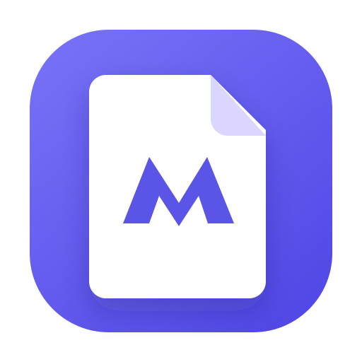
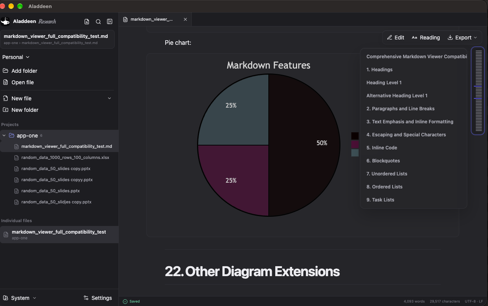
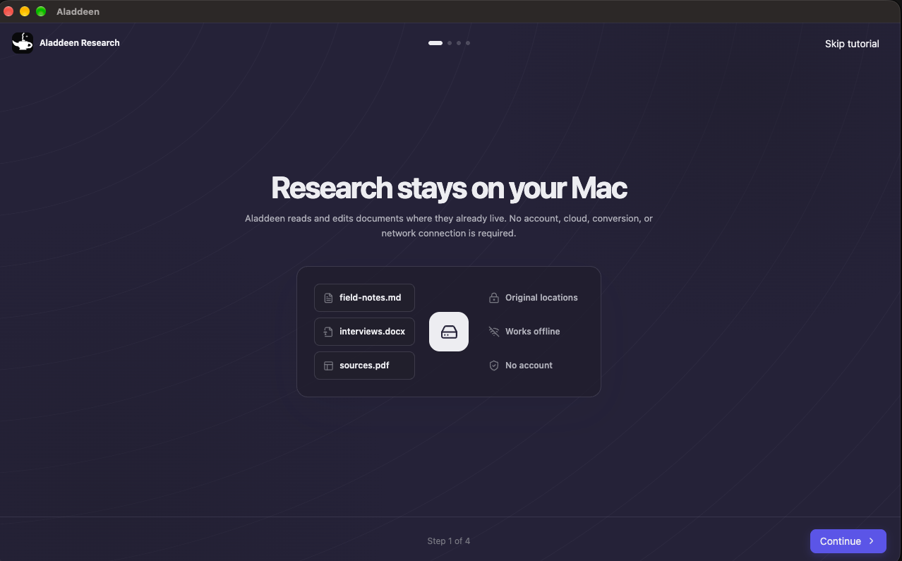
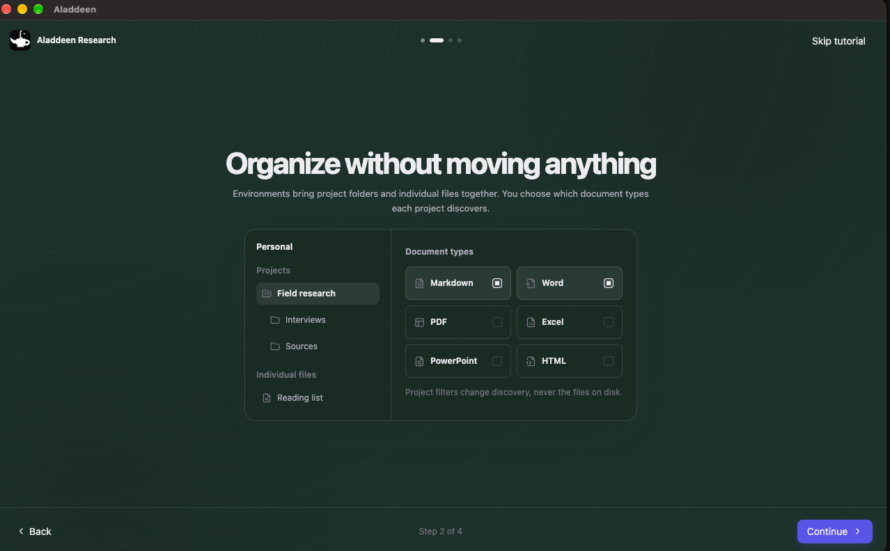
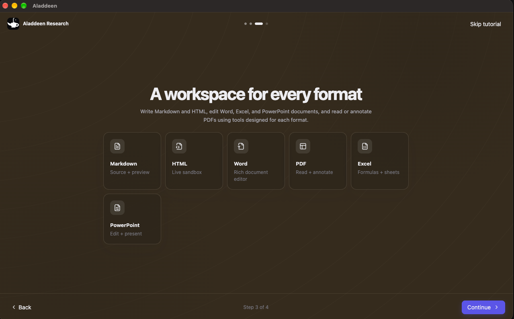
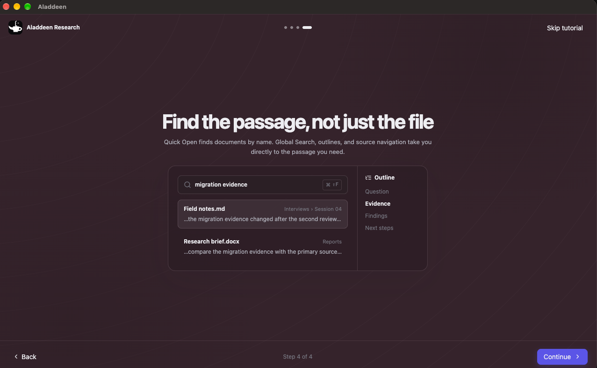
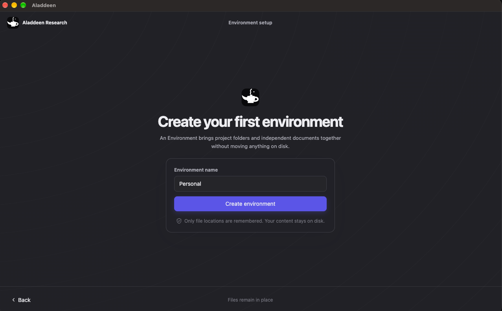
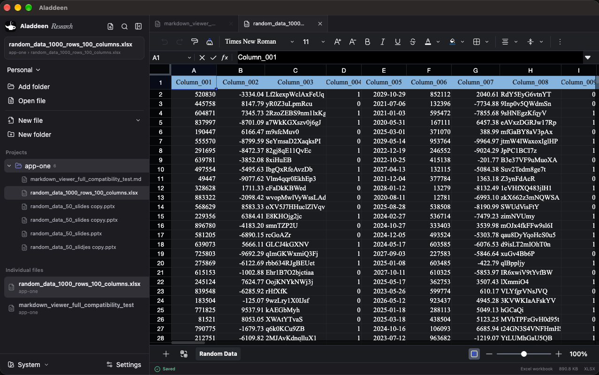
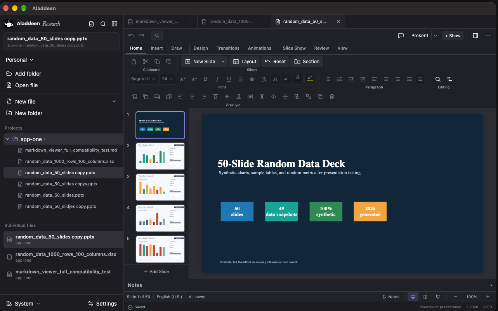
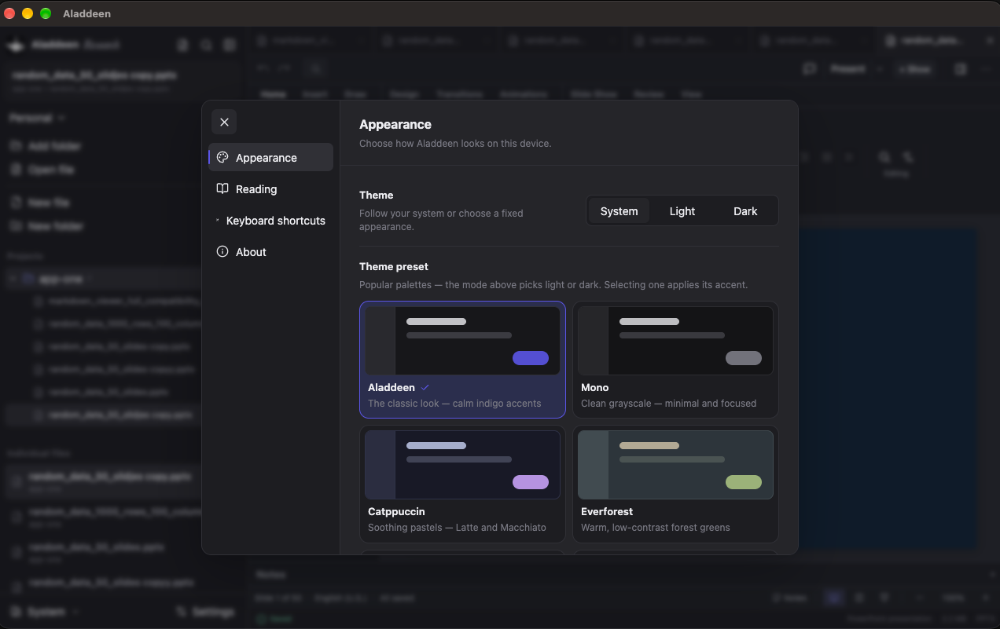

  

<h1 align="center">Aladdeen Research</h1>

  <strong>One calm workspace for all your research documents, right on your Mac.</strong> 
  Read, edit, organize, and search Markdown, Word, Excel, PowerPoint, PDF, and HTML files in place. Fully offline.

  <a href="https://aladdeen.aliahad.com"><strong>Download for Mac</strong></a>
  &nbsp;·&nbsp;
  <a href="https://github.com/aliahadmd/aladdeen/releases/latest">Latest release</a>

  

Research ends up scattered across notes, reports, spreadsheets, slide decks, and PDFs. Aladdeen brings them into one window without moving, copying, converting, or uploading anything. Your files stay exactly where they are on disk, and every format opens in a tool built for it.

- **Every format in one place.** Markdown, HTML, Word (.docx), PDF, Excel (.xlsx), and PowerPoint (.pptx).
- **Your files never move.** Aladdeen opens documents where they already live and saves changes back to the same file.
- **Private by design.** No account, no cloud, no tracking. It works without an internet connection.
- **Find the passage, not just the file.** Search inside every document at once and jump straight to the match.

## Download and install

**You need** a Mac with Apple silicon (M1, M2, M3, M4, or newer) running macOS 12 Monterey or later. Intel Macs, Windows, and Linux are not supported.

1. Download the latest `Aladdeen-…-arm64.dmg` from [aladdeen.aliahad.com](https://aladdeen.aliahad.com) or from the [releases page](https://github.com/aliahadmd/aladdeen/releases/latest).
2. Open the downloaded file and drag **Aladdeen** into your **Applications** folder.
3. Open Aladdeen from Applications.

### The first time you open it

Aladdeen is not yet notarized by Apple, so the first time you open it macOS shows a warning that it can't verify the developer. To allow it:

1. Click **Done** (or **Cancel**) on the warning.
2. Open **System Settings → Privacy & Security** and scroll down to the **Security** section.
3. Next to the message about Aladdeen, click **Open Anyway**, then confirm.

You only need to do this once. On older versions of macOS you can instead right-click Aladdeen in Applications, choose **Open**, and confirm.

Want to make sure your download is genuine? Each [release](https://github.com/aliahadmd/aladdeen/releases) lists the file's exact size and SHA-256 checksum. You can compare it by running `shasum -a 256` on the downloaded file in Terminal.

## Getting started

When you first open Aladdeen, a short tour shows what it can do. You can skip it at any time.

<table>
  <tr>
    <td width="50%"></td>
    <td width="50%"></td>
  </tr>
  <tr>
    <td><strong>Research stays on your Mac.</strong> Documents are read and edited where they already live.</td>
    <td><strong>Organize without moving anything.</strong> Group folders and files, and choose which document types each folder shows.</td>
  </tr>
  <tr>
    <td></td>
    <td></td>
  </tr>
  <tr>
    <td><strong>A workspace for every format.</strong> Each file type opens in an editor designed for it.</td>
    <td><strong>Find the passage, not just the file.</strong> Search inside documents and jump to the exact spot.</td>
  </tr>
</table>

Then you create your first **environment**, a named workspace such as "Personal", "Thesis", or "Client work".

  

From there:

- **Add a folder** to bring in a project folder. Aladdeen lists the documents inside it and keeps the list up to date as files change. You choose which document types it shows and can hide subfolders you don't need.
- **Open file** to work with a single document that isn't part of a folder.
- **Drag files from Finder** into the window to open them.
- Double-click a supported file in Finder, or use **Open With → Aladdeen**.

You can keep several environments and switch between them; each one remembers its own open tabs. Folders can be pinned, grouped, or archived to keep the sidebar tidy.

## What you can do

### Markdown

Write in a clean editor and read in a polished preview, side by side or one at a time. Tables, task lists, code blocks, footnotes, math, and Mermaid diagrams render right in the preview. A heading outline lets you jump around long documents, and while editing, clicking text in the preview takes you to that line in the editor. Export any Markdown document to **PDF** or **Word**.

### Excel workbooks

  

Edit .xlsx files with formulas, formatting, multiple sheets, sorting, filters, conditional formatting, data validation, and find & replace. Workbooks that use features Aladdeen can't fully reproduce are protected: you're asked to save a copy, or the file opens read-only, so nothing is silently lost.

### PowerPoint presentations

  

Edit slides, text, layouts, and speaker notes, then present full screen. Parts of a presentation you didn't touch are saved back exactly as they were.

### Word documents

Edit .docx files with rich formatting, comments, and tracked changes.

### PDFs

Read PDFs with selectable text, search, and an outline. Fill in forms, highlight, add notes and stamps, and rotate or remove pages. Password-protected PDFs open after you enter the password.

### HTML

Edit HTML source with a live preview next to it. The preview runs with scripts, forms, and network access turned off, so opening a page is always safe.

## Finding things

- **Quick Open** (`⌘P`) finds any file in your environment by name.
- **Search** (`⌘⇧F`) looks inside every document at once (Markdown, Word, PDF, Excel, PowerPoint, and HTML) and takes you straight to the matching sentence, cell, or slide. It even includes unsaved changes in documents you have open.
- **Outlines** let you jump between headings in Markdown, Word, and PDF documents.

## Saving and your files

- Changes are saved when you press `⌘S` or click **Save**. The status bar shows **Unsaved** until you do.
- When you close a document or quit, Aladdeen saves your open changes first so nothing is lost.
- If a file is changed by another app while it's open, Aladdeen notices. If you haven't edited it, the document simply reloads; if you have, you choose which version to keep, or save your edits as a separate copy.
- Renaming, moving to Trash, and revealing in Finder all act on the real files. Trashed files go to your Mac's Trash, so you can restore them.
- **Remove** in the sidebar only takes a file off the list. The file itself stays on disk.

## Make it yours

  

Choose light, dark, or follow your Mac's setting, and pick from eight themes: Aladdeen, Mono, Catppuccin, Everforest, Solarized, Nord, Rosé Pine, and Gruvbox. Reading settings let you adjust the font, text size, line spacing, and column width for comfortable long-form reading.

## Keyboard shortcuts

| Shortcut | Action |
| --- | --- |
| `⌘O` | Open a document |
| `⌘N` | New Markdown document |
| `⌘⇧O` | Add a folder |
| `⌘P` | Quick Open: find a file by name |
| `⌘⇧F` | Search inside all documents |
| `⌘S` | Save |
| `⌘E` | Switch between editing and reading a Markdown document |

## Privacy

Aladdeen works entirely on your Mac.

- There is no account, sign-in, or cloud sync.
- It doesn't fetch remote images or content and sends no analytics or tracking data.
- It only remembers which folders and files you've added, your open tabs, and your settings. That information is stored on your Mac in `~/Library/Application Support/aladdeen`. Your documents' contents are never copied there.

## Questions

**Is Aladdeen free?**
Yes, during the current beta. Future versions may be paid. Aladdeen is proprietary software by [Ali Ahad](https://aliahad.com); the beta is free to use, but it is not open source.

**Does it work on an Intel Mac, Windows, or Linux?**
No. Aladdeen is built only for Macs with Apple silicon.

**How do I update?**
Download the newest version and replace the app in your Applications folder. Your environments and settings are kept. Aladdeen doesn't update itself automatically.

**How do I uninstall it?**
Drag Aladdeen from Applications to the Trash. To also remove its list of folders and settings, delete `~/Library/Application Support/aladdeen`. Your documents are not affected either way.

---

Building Aladdeen from source? See [DEVELOPMENT.md](DEVELOPMENT.md). Open-source components and their licenses are listed in [THIRD_PARTY_NOTICES.md](THIRD_PARTY_NOTICES.md).
